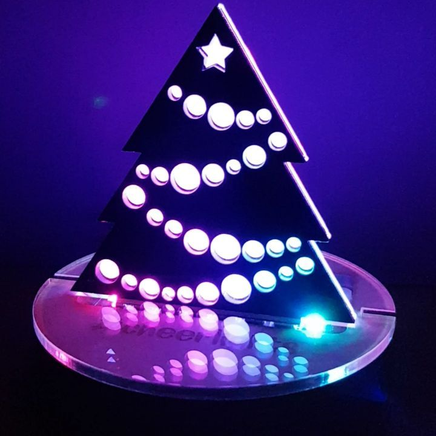

# Christmas Tree Workshop
In 2017 I ran a workshop with the Manchester Girl Geeks at Fablab Altrincham.

This repository contains the code for a small website and python script to enable an element of customisation.

  
The website was temporarily live, with the link distributed to participants signed up for the workshop. They were able to layout circles on a christmas tree, when they hit save an svg of their design is sent and stored on the server. Those SVGs were then sent to me before the workshop. A python script I ran locally on my laptop then collated all the svgs which could be lasercut. This meant that each participant had their own custom tree for the workshop. During the workshop I talked them through writing a python script to run on a raspberry pi. The code interacted with the twitter API, looking at the #cheerlights hashtag and the colours tweeted on it. It then communicated with the blinkt hat (a small raspberry pi hat that sits 8 neopixels on top of the gpio pins) to change the colour of the ornaments on the christmas tree. Optional stretch goals were making custom rainbow or candycane modes.

 
